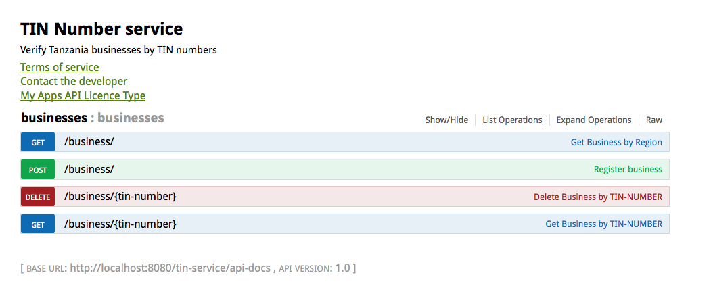

tin-service API
===========
Tanzania Business (taxpayers) verification/look up services by TINv-vNumber intended for software/applications consumptions.
This Service exposes a set Rest endpoint indicated below .

# Technologies
# 1.Maven
# 2.Java 1.7
# 3.Spring core 
# 4.SpringMVC
# 5.Spring HATEOAS 
# 6.SpringData Mongo
# 7.Mongo DB

## USAGE
You will need a running instance of MongoDB
Change the following line  in application-context.xml accordingly  
<code><mongo:db-factory id="mongoDbFactory" dbname="b-directory"  /> </code>  
You can then deploy a war or use the embedded  tomcat7 plugin  through Maven .

On any browser point to the Swagger API documentation @http://localhost:8080/tin-service/docs/index.html
Use the POST option to register as many business as you want or use the onetime load option explained below

# Loading sample data ,onetime load (option)
Have included sample data folder 'tin-xls', into mongoDB
Check this line in application-context.xml is uncommented <code><context:component-scan base-package="com.iddymagohe.tin"/> </code>  
Only needed for this purpose, comment it back after loading the data
Run the following test case in ReadXSLUtilTest, remember to add @Test Junit annotation. then switchback to @Ignore 
 
 <tt>@Ignore
           public void loadIlala(){
                   xslsUtil.readFileData("ILALA.xls");
           }
  </tt>

If everything looks good , that`s it, otherwise please log an issue

## What is next
Pursuing a single point to host and maintain this service,(will check with TRA) so that countrywide application developers
can easily interact with this service through the exposed rest endpoints for various use-cases

## Currently working on a project that needs a service like this to be in place.
